# DUTO Platform Architecture v1.2

> **The Complete AI-Powered Content Creation Ecosystem** > **Last Updated:** December 2025
> **Version:** 1.2
> **Status:** Production

---

## Table of Contents

### Part I: Platform Overview

1. [Executive Summary](#1-executive-summary)
2. [Full Circle Vision](#2-full-circle-vision)
3. [System Architecture Overview](#3-system-architecture-overview)
4. [The Four Pillars](#4-the-four-pillars)
5. [Dual Mode Architecture](#5-dual-mode-architecture)

### Part II: Flow Editor

6. [Flow Editor Architecture](#6-flow-editor-architecture)
7. [Node System](#7-node-system)
8. [AI Flow Generator](#8-ai-flow-generator)
9. [Brain Node Deep Dive](#9-brain-node-deep-dive)
10. [Workflow Execution Engine](#10-workflow-execution-engine)

### Part III: Storyboard

11. [Storyboard Architecture](#11-storyboard-architecture)
12. [Orchestrator-Worker Pattern](#12-orchestrator-worker-pattern)
13. [Subject Consistency System](#13-subject-consistency-system)
14. [Shot Generation Pipeline](#14-shot-generation-pipeline)
15. [Music Video Generation](#15-music-video-generation)

### Part IV: Content Library

16. [Content Library Architecture](#16-content-library-architecture)
17. [Artifact System](#17-artifact-system)
18. [Cross-System Integration](#18-cross-system-integration)

### Part V: Movie Editor

19. [Movie Editor Architecture](#19-movie-editor-architecture)
20. [Timeline System](#20-timeline-system)
21. [FFmpeg Export Pipeline](#21-ffmpeg-export-pipeline)

### Part VI: Integration & API

22. [Integration Architecture](#22-integration-architecture)
23. [API Gateway Architecture](#23-api-gateway-architecture)
24. [Async Processing Patterns](#24-async-processing-patterns)

### Part VII: Infrastructure

25. [Backend Edge Functions](#25-backend-edge-functions)
26. [Database Schema](#26-database-schema)
27. [Security Architecture](#27-security-architecture)

### Part VIII: Future Roadmap

28. [Planned Features](#28-planned-features)

---

# Part I: Platform Overview

## 1. Executive Summary

DUTO is a comprehensive AI-powered content creation platform that unifies visual workflow design, AI storyboard generation, content management, and video editing into a seamless creative ecosystem.

### Platform Components

| Component           | Purpose                | Key Features                                          |
| ------------------- | ---------------------- | ----------------------------------------------------- |
| **Flow Editor**     | Visual workflow design | 55 nodes, AI generation, Brain intelligence           |
| **Storyboard**      | AI video planning      | Orchestrator-Worker, vision-based subject consistency |
| **Content Library** | Asset management       | Folder organization, cross-system access              |
| **Movie Editor**    | Video composition      | Multi-track timeline, FFmpeg export                   |

### Technology Stack


### Key Metrics

- **55 Node Types** in Flow Editor
- **11 Specialized Workers** in Storyboard
- **6 Brain Tools** for research and intelligence
- **16 AI Generator Options** for workflow creation
- **18 Edge Functions** for backend operations
- **2 Media Providers**: WaveSpeed + Kie.ai (Alt)
- **Multi-track** timeline with **FFmpeg.wasm** export

---

## 2. Full Circle Vision

### The Complete Content Journey

DUTO enables a complete content creation workflow from idea to final export:

```mermaid
graph LR
    subgraph Normal["Normal Mode"]
        IDEA[💡 Idea] --> SB[📋 Storyboard]
        SB --> GEN[🎬 Generation]
        GEN --> LIB[📁 Library]
        LIB --> ME[🎥 Movie Editor]
        ME --> EXPORT[📤 Export]
    end

    subgraph Advanced["Advanced Mode"]
        FLOW[🔧 Flow Editor] --> |Auto-save| LIB
        FLOW --> |StoryboardNode| SB
        FLOW --> |API Endpoint| API[🌐 API]
        API --> EXTERNAL[External Apps]
    end

    style IDEA fill:#10B981
    style EXPORT fill:#3B82F6
    style API fill:#8B5CF6
```



### Two Modes of Operation

#### Normal Mode (Default)

For users focused on content creation without technical complexity:

- **Storyboard** → Describe idea → AI generates complete video plan
- **Library** → Browse and manage generated content
- **Movie Editor** → Arrange, edit, export final videos

#### Advanced Mode

For power users who want granular control:

- **Flow Editor** → Build custom AI workflows with 55 nodes
- **Brain Nodes** → Add intelligence and research capabilities
- **API Endpoints** → Expose workflows as APIs
- **Full Integration** → Feed Flow content into Storyboard automatically

### Full Circle Data Flow


---

## 3. System Architecture Overview

### High-Level Architecture


### Request Flow


---

## 4. The Four Pillars

### Pillar 1: Flow Editor

The visual workflow design environment for building custom AI content pipelines.


**Key Features:**

- 55 specialized nodes (generation, enhancement, control flow, intelligence)
- AI Flow Generator with 16 configurable options
- Brain Node with Master-Slave architecture
- Real-time visual execution feedback
- API Endpoint exposure (Phase A)

### Pillar 2: Storyboard

AI-powered video storyboard generation from natural language descriptions.


**Key Features:**

- Orchestrator-Worker pattern with 11 specialized workers
- Vision-based subject consistency via reference registry
- Three cinematography modes (Auto, Presets, Manual)
- Human-in-the-loop pause/review workflow
- Library Browser for Flow content reuse
- Source material "Use in Story" toggle
- Music Video generation mode

### Pillar 3: Content Library

Central hub for all generated and uploaded media assets.


**Key Features:**

- Folder-based organization (auto-saved, custom folders)
- Source tracking (flow-editor, storyboard, upload)
- Cross-system access (Library Browser in Storyboard)
- Artifact metadata (prompt, model, node, timestamp)

### Pillar 4: Movie Editor

Multi-track timeline editor for final video composition and export.


**Key Features:**

- Multi-layer timeline with video and audio tracks
- Clip splitting, trimming, reordering
- Track mute/solo controls
- Waveform visualization for audio
- FFmpeg.wasm export with progress tracking
- Keyboard shortcuts (Space, S, Delete, Ctrl+Z)

---

## 5. Dual Mode Architecture

### Mode Toggle System

```typescript
// useAppMode.tsx
interface AppModeContext {
  mode: 'normal' | 'advanced'
  setMode: (mode: 'normal' | 'advanced') => void
  isAdvanced: boolean
}

// Persisted to localStorage
const [mode, setMode] = useState<'normal' | 'advanced'>(() => {
  return (localStorage.getItem('app-mode') as any) || 'normal'
})
```

### Navigation by Mode

| Route              | Normal Mode            | Advanced Mode |
| ------------------ | ---------------------- | ------------- |
| `/`                | Redirect to Storyboard | Flow Editor   |
| `/storyboard`      | ✓ Visible              | ✓ Visible     |
| `/library`         | ✓ Visible              | ✓ Visible     |
| `/movie-editor`    | ✓ Visible              | ✓ Visible     |
| `/docs`            | ✓ Visible              | ✓ Visible     |
| `/flow`            | ✗ Hidden               | ✓ Visible     |
| Hub Menu (My APIs) | ✗ Hidden               | ✓ Visible     |

### Header Navigation

```tsx
const Header: React.FC = () => {
  const { isAdvanced } = useAppMode()

  return (
    <header>
      <nav>
        {isAdvanced && <NavLink to="/">Flow Editor</NavLink>}
        <NavLink to="/storyboard">Storyboard</NavLink>
        <NavLink to="/library">Library</NavLink>
        <NavLink to="/movie-editor">Movie Editor</NavLink>
        <NavLink to="/docs">Docs</NavLink>
        {isAdvanced && <HubMenu />} {/* My APIs dropdown */}
      </nav>

      <div className="controls">
        <ModeToggle /> {/* Normal/Advanced toggle */}
        <ThemeToggle /> {/* Light/Dark theme */}
      </div>
    </header>
  )
}
```

---

# Part II: Flow Editor

## 6. Flow Editor Architecture

### Component Structure


### State Management

```typescript
interface StudioStore {
  // Canvas
  nodes: Node[]
  edges: Edge[]

  // Node Data
  nodeData: Record<string, any>
  nodeRuns: Record<string, NodeRuntimeData>

  // Execution
  currentRun: WorkflowRun | null
  abortController: AbortController | null

  // Artifacts
  artifacts: Artifact[]

  // UI
  selectedNodeId: string | null
  inspectorOpen: boolean

  // Actions
  setNodes: (nodes: Node[]) => void
  updateNode: (id: string, data: any) => void
  updateNodeRun: (id: string, run: Partial<NodeRuntimeData>) => void
  startRun: () => void
  cancelRun: () => void
  addArtifact: (artifact: Artifact) => void
}
```

### Dual State Synchronization

React Flow maintains local state for performance, while Zustand holds authoritative node data:

```typescript
// Sync pattern in FlowEditor.tsx
useEffect(() => {
  const storeNodes = useStudioStore.getState().nodes

  // Only sync user-input fields, not runtime fields
  const userFieldsChanged = detectUserFieldChanges(storeNodes, localNodes)

  // Skip during execution
  if (currentRun?.status === 'running') return

  if (userFieldsChanged) {
    setNodes(storeNodes)
  }
}, [storeNodes])
```

---

## 7. Node System

### Node Categories (55 Nodes)


### Handle Type System

```typescript
const HANDLE_TYPES = {
  image: { color: '#3B82F6', label: 'Image' }, // Blue
  video: { color: '#8B5CF6', label: 'Video' }, // Purple
  audio: { color: '#10B981', label: 'Audio' }, // Green
  text: { color: '#F59E0B', label: 'Text' }, // Yellow
  flow: { color: '#6B7280', label: 'Flow' }, // Gray
  mask: { color: '#EC4899', label: 'Mask' }, // Pink
  any: { color: '#9CA3AF', label: 'Any' }, // Gray
  brain: { color: '#06B6D4', label: 'Brain' }, // Cyan
  json: { color: '#EA580C', label: 'JSON' }, // Orange
  log: { color: '#6B7280', label: 'Log' }, // Gray
  scene: { color: '#06B6D4', label: 'Scene' }, // Cyan
  capture: { color: '#F97316', label: 'Capture' }, // Orange
  ctx: { color: '#F59E0B', label: 'Context' } // Yellow
}
```

### Connection Validation

```typescript
const TYPE_COMPATIBILITY: Record<HandleType, HandleType[]> = {
  image: ['image', 'any'],
  video: ['video', 'any'],
  audio: ['audio', 'any'],
  text: ['text', 'any', 'ctx'],
  flow: ['flow'],
  mask: ['mask', 'image'],
  any: ['image', 'video', 'audio', 'text', 'any', 'json'],
  brain: ['brain'],
  json: ['json', 'any', 'text'],
  log: ['log', 'any'],
  scene: ['scene'],
  capture: ['capture'],
  ctx: ['ctx', 'text', 'any']
}

function isValidConnection(connection: Connection): boolean {
  const sourceType = getOutputType(connection.source, connection.sourceHandle)
  const targetType = getInputType(connection.target, connection.targetHandle)

  return TYPE_COMPATIBILITY[sourceType]?.includes(targetType) ?? false
}
```

### Static Handles Pattern

Critical for React Flow reliability:

```tsx
// ✅ CORRECT: Static handles with conditional visibility
<Handle
  type="source"
  id="image_out"
  style={{
    top: '64px',
    opacity: outputType === 'image' ? 1 : 0,
    pointerEvents: outputType === 'image' ? 'auto' : 'none'
  }}
  isConnectable={true}
/>

// ❌ WRONG: Dynamic mounting breaks connection validation
{outputType === 'image' && <Handle ... />}
```

---

## 8. AI Flow Generator

### Architecture


### 16 Configurable Options

| Option                 | Type     | Description                           |
| ---------------------- | -------- | ------------------------------------- |
| `prompt`               | string   | Natural language workflow description |
| `model`                | enum     | LLM model (gemini-2.5-flash default)  |
| `voiceInput`           | boolean  | Web Speech API voice input            |
| `referenceImages`      | File[]   | Style reference images                |
| `extendMode`           | boolean  | Extend existing flow                  |
| `addPreviewNodes`      | boolean  | Auto-attach preview nodes             |
| `addApiEndpoint`       | boolean  | Include API endpoint node             |
| `requireAudio`         | boolean  | Force Veo3 for audio                  |
| `preferKling`          | boolean  | Prefer cheaper Kling models           |
| `enableResearch`       | boolean  | Tavily research at design-time        |
| `researchDepth`        | enum     | basic/advanced/news                   |
| `researchTopics`       | string[] | Specific research topics              |
| `cinematicMode`        | boolean  | Cinematography presets                |
| `storyBible`           | boolean  | Generate Story Bible                  |
| `characterConsistency` | boolean  | Character reference reuse             |
| `existingFlowContext`  | object   | Current canvas for extend mode        |

### Dynamic Keyword Detection

Keywords that trigger run-time Brain nodes:

```typescript
const RUN_TIME_KEYWORDS = [
  'random',
  'varied',
  'different each',
  'unique each',
  'current',
  'today',
  'latest',
  'live',
  'real-time',
  'research',
  'find',
  'search',
  'look up',
  'trending',
  'popular',
  'news',
  'recent'
]
```

### Validation & Correction Loop

```typescript
async function generateWithValidation(
  prompt: string,
  options: GenerateOptions
): Promise<DualityFlowDocument> {
  let attempt = 0
  let lastError: string | null = null

  while (attempt <= 2) {
    const result = await callGenerateFlow(prompt, options, lastError)
    const validation = validateFlow(result)

    if (validation.isValid) {
      return normalizeNodeTypes(result)
    }

    lastError = validation.errors.join('\n')
    attempt++
  }

  throw new Error('Generation failed after corrections')
}
```

---

## 9. Brain Node Deep Dive

### Architecture


### Four Modes

| Mode         | Purpose             | Tools        | Output               |
| ------------ | ------------------- | ------------ | -------------------- |
| **Creative** | Varied generation   | None         | Diverse ideas        |
| **Research** | Factual data        | Tavily       | Verified facts       |
| **Hybrid**   | Research + creative | Tavily + LLM | Grounded content     |
| **Analysis** | Classification      | None         | Structured decisions |

### Output Type Selector

| Output Type         | Handle      | Description                   |
| ------------------- | ----------- | ----------------------------- |
| **Auto**            | LLM decides | Automatic output selection    |
| **Text**            | `text_out`  | Narratives, summaries         |
| **Chart Data**      | `json_out`  | Structured data for ChartNode |
| **Image URLs**      | `image_out` | Reference images from search  |
| **Structured JSON** | `json_out`  | Custom JSON structure         |

### Master-Slave Pattern


### Six Brain Tools

```typescript
const brainTools = {
  webSearch: {
    description: 'Search the web for current information',
    parameters: { query: 'string', maxResults: 'number' }
  },
  imageSearch: {
    description: 'Search for images matching description',
    parameters: { query: 'string', maxResults: 'number' }
  },
  extractUrl: {
    description: 'Extract content from URL',
    parameters: { url: 'string' }
  },
  crawlSite: {
    description: 'Crawl website for multiple pages',
    parameters: { url: 'string', maxPages: 'number' }
  },
  mapSite: {
    description: 'Get sitemap of website',
    parameters: { url: 'string' }
  },
  videoAnalysis: {
    description: 'Analyze video content',
    parameters: { videoUrl: 'string' }
  }
}
```

### Two-Tier Fallback System


---

## 10. Workflow Execution Engine

### Execution Flow


### Multi-Provider Routing


```typescript
// nodeHandlers.ts provider detection
const isKieAi = selectedModel.startsWith('kie.ai/');

if (isKieAi) {
  // Route to Kie.ai edge functions
  await supabase.functions.invoke('generate-image-kie', { ... });
  // Poll via poll-kie-job
} else {
  // Route to WaveSpeed edge functions
  await supabase.functions.invoke('generate-image', { ... });
  // Poll via poll-wavespeed-job
}
```

### Auto-Wait for Multi-Input Nodes

```typescript
async function executeNode(nodeId: string, visited: Set<string>) {
  const incomingEdges = edges.filter((e) => e.target === nodeId)

  if (incomingEdges.length > 1) {
    const allReady = incomingEdges.every(
      (edge) => nodeRuns[edge.source]?.status === 'success'
    )

    if (!allReady) return // Will be triggered when last input arrives
  }

  visited.add(nodeId)
  // Execute...
}
```

### Cancellation via AbortController

```typescript
function cancelRun() {
  abortController?.abort()

  // Reset running/pending nodes
  Object.entries(nodeRuns).forEach(([id, run]) => {
    if (run.status === 'running' || run.status === 'pending') {
      updateNodeRun(id, { status: 'idle' })
    }
  })

  set({ currentRun: { ...currentRun, status: 'cancelled' } })
}
```

---

# Part III: Storyboard

## 11. Storyboard Architecture

### Component Structure


### Data Model

```typescript
interface DualityStoryDocument {
  id: string
  version: string
  project: StoryboardProject
  scenes: Scene[]
}

interface StoryboardProject {
  id: string
  title: string
  format: '9:16' | '16:9' | '1:1'
  duration: number
  goal:
    | 'brand_ad'
    | 'short_film'
    | 'tiktok_reel'
    | 'explainer'
    | 'product_demo'
    | 'music_video'
  stylePreset: string
  idea: string
  modelPreferences: {
    imageModel:
      | 'auto'
      | 'seedream-v4.5'
      | 'nano-banana-pro'
      | 'kie-nano-banana'
      | 'flux-kontext'
    videoModel: 'auto' | 'veo' | 'hailuo' | 'wan' | 'kling' | 'kling-2.6'
    llmModel?: 'gemini-2.5-flash' | 'deepseek-chat' | 'gemini-2.5-pro'
    requireSound: boolean
    singleModelConsistency: boolean
    budgetMode: boolean
  }
  // Music Video specific fields
  audioTrackUrl?: string
  audioAnalysis?: AudioAnalysis
  musicVideoAnalysis?: MusicVideoAnalysis
}

interface Scene {
  id: string
  title: string
  description: string
  duration: number
  shots: Shot[]
}

interface Shot {
  id: string
  sceneId: string
  description: string
  visualPrompt: string
  duration: number
  cinematography: Cinematography
  subjectAppearances: string[]
  status: ShotStatus
  heroFrameUrl?: string
  videoUrl?: string
  // Music video timing
  startTime?: number
  audioSectionId?: string
  beatAligned?: boolean
}

type ShotStatus =
  | 'pending'
  | 'generating_image'
  | 'image_ready'
  | 'generating_video'
  | 'complete'
  | 'error'
```

---

## 12. Orchestrator-Worker Pattern

### Four-Phase Pipeline


### 11 Specialized Workers

| Worker                          | Phase | Purpose                           |
| ------------------------------- | ----- | --------------------------------- |
| `characterReferenceWorker`      | 1     | Detect characters from references |
| `researchWorker`                | 1     | Tavily factual research           |
| `referenceDigestWorker`         | 1     | Analyze reference style           |
| `storyBibleWorker`              | 2     | Generate story bible              |
| `storyboardPlanWorker`          | 2     | Create scene/shot structure       |
| `consistencyValidatorWorker`    | 2     | Validate subject appearances      |
| `cinematographerDirectorWorker` | 3     | Design camera/lens                |
| `lightingDirectorWorker`        | 3     | Design lighting                   |
| `soundDesignWorker`             | 3     | Sound design notes                |
| `musicSupervisorWorker`         | 3     | Music direction                   |
| `outputStoryboardWorker`        | 4     | Assemble final document           |

### Sequential Execution Pattern

```typescript
// Direct sequential calls (not agentic)
async function executeGeneration(project: StoryboardProject) {
  // Phase 1
  const characters = await characterReferenceWorker.execute(project)
  const research = await researchWorker.execute(project)
  const digest = await referenceDigestWorker.execute(project)

  // Phase 2
  const storyBible = await storyBibleWorker.execute({
    ...input,
    research,
    digest
  })
  const plan = await storyboardPlanWorker.execute({ storyBible })
  await consistencyValidatorWorker.execute({ plan, characters })

  // Phase 3
  const cinema = await cinematographerDirectorWorker.execute(plan)
  const lighting = await lightingDirectorWorker.execute(plan)
  const sound = await soundDesignWorker.execute(plan)
  const music = await musicSupervisorWorker.execute(plan)

  // Phase 4
  return outputStoryboardWorker.execute({
    plan,
    cinema,
    lighting,
    sound,
    music
  })
}
```

---

## 13. Subject Consistency System

### Vision-Based Detection


### Subject Registry

```typescript
interface SubjectReference {
  id: string
  name: string
  type: 'character' | 'product' | 'object' | 'vehicle'
  description: string
  referenceImageUrl: string
  visualAnchor: string
  matchingKeywords: string[]
  appearances: string[] // Shot IDs
}
```

### Consistency Flow

```mermaid
graph TD
    REF[Reference Images] --> DETECT[Character Detection]
    SHOTS[Shot Descriptions] --> MATCH[Keyword Matching]

    DETECT --> REGISTRY[Subject Registry]
    MATCH --> REGISTRY

    REGISTRY --> CHECK{In Registry?}
    CHECK -->|Yes| EDIT[Use Edit Model + Reference]
    CHECK -->|No| GENERATE[Generate Fresh]

    EDIT --> OUTPUT[Consistent Output]
    GENERATE --> DETECTNEW[Detect Subjects]
    DETECTNEW --> REGISTRY
    GENERATE --> OUTPUT
```

---

## 14. Shot Generation Pipeline

### Status State Machine

```mermaid
stateDiagram-v2
    [*] --> pending
    pending --> generating_image: Start
    generating_image --> image_ready: Complete
    generating_image --> error: Failed
    image_ready --> generating_video: Continue
    generating_video --> complete: Complete
    generating_video --> error: Failed
    error --> pending: Retry
```

### Human-in-the-Loop Pause

```typescript
async function generateWithPause(document: DualityStoryDocument) {
  // Generate all hero frames
  for (const shot of allShots) {
    await generateHeroFrame(shot, document.project)
    await detectSubjects(shot.heroFrameUrl) // Save to registry
  }

  // Pause for review
  set({ pendingConfirmation: true, phase: 'paused_for_review' })

  // User can:
  // 1. "Open in Storyboard UI" - make edits
  // 2. "Continue to Video" - proceed
  // 3. "Cancel" - stop
}
```

---

## 15. Music Video Generation

### Goal Type: `music_video`

When `goal` is set to `music_video`, Storyboard uses a specialized orchestrator:

```mermaid
flowchart TB
    AUDIO[Audio Track URL] --> ORCHESTRATOR[generate-music-video-orchestrated]

    subgraph Phases["5-Phase Pipeline"]
        P1[1. Audio Analysis]
        P2[2. Lyrics Extraction]
        P3[3. Story Interpretation]
        P4[4. Visual Bible Creation]
        P5[5. Scene Generation]

        P1 --> P2 --> P3 --> P4 --> P5
    end

    ORCHESTRATOR --> Phases
    Phases --> OUTPUT[MusicVideoAnalysis]
```

### Music Video Orchestrator

```typescript
// generate-music-video-orchestrated phases
async function orchestrateMusicVideo(
  audioTrackUrl: string,
  visualTheme: string
) {
  // Phase 1: Audio Analysis
  const audioAnalysis = await executeAnalyzeAudio(audioTrackUrl)
  // Detects: sections, BPM, key, genre, energy levels

  // Phase 2: Lyrics Extraction
  const lyricsExtraction = await executeExtractLyrics(audioTrackUrl)
  // Extracts: full lyrics, themes, key imagery per section

  // Phase 3: Story Interpretation
  const storyInterpretation = await executeInterpretStory(
    audioAnalysis,
    lyricsExtraction
  )
  // Creates: narrative arc, protagonist, emotional journey

  // Phase 4: Visual Bible Creation
  const visualBible = await executeCreateVisualBible(
    storyInterpretation,
    visualTheme
  )
  // Defines: visual style, motifs, recurring elements

  // Phase 5: Scene Generation
  const scenes = await executeGenerateScenes(visualBible, audioAnalysis)
  // Generates: timed scenes and shots aligned to audio sections

  return {
    audioAnalysis,
    lyricsExtraction,
    storyInterpretation,
    visualBible,
    scenes
  }
}
```

### MusicVideoAnalysis Structure

```typescript
interface MusicVideoAnalysis {
  audioAnalysis: AudioAnalysis // BPM, sections, energy
  lyricsExtraction: LyricsExtraction // Full lyrics, themes
  storyInterpretation: StoryInterpretation // Narrative arc
  visualBible: VisualBible // Style guide
}

interface AudioAnalysis {
  bpm: number
  key: string
  genre: string
  sections: AudioSection[]
}

interface AudioSection {
  id: string
  type: 'intro' | 'verse' | 'chorus' | 'bridge' | 'outro'
  startTime: number
  endTime: number
  energy: number // 0-100
  mood: string
  visualSuggestion: string
}

interface LyricsExtraction {
  fullLyrics: string
  themes: string[]
  sectionLyrics: Record<string, string>
  keyImagery: string[]
}

interface StoryInterpretation {
  videoType:
    | 'narrative'
    | 'emotional_journey'
    | 'abstract'
    | 'performance'
    | 'concept'
  protagonist?: string
  narrativeArc: string
  emotionalJourney: string[]
}

interface VisualBible {
  style: string
  colorPalette: string[]
  motifs: string[]
  transitions: string[]
}
```

### Shot Timing Fields

Music video shots include timing metadata:

```typescript
interface Shot {
  // ... standard fields
  startTime?: number // Absolute timeline position
  audioSectionId?: string // Links to audio section
  beatAligned?: boolean // Cut on beat
  timingRationale?: string // "cuts on chorus drop"
}
```

---

# Part IV: Content Library

## 16. Content Library Architecture

### Central Hub Design

```mermaid
graph TB
    subgraph Sources
        FLOW[Flow Editor]
        SB[Storyboard]
        UPLOAD[Direct Upload]
    end

    subgraph Library["Content Library"]
        STORE[(Artifact Store)]
        FOLDERS[Folder Organization]
        META[Metadata Index]
    end

    subgraph Consumers
        LB[Library Browser]
        GRID[Library Grid View]
        ME[Movie Editor]
    end

    Sources --> Library
    Library --> Consumers
```

---

## 17. Artifact System

### Artifact Structure

```typescript
interface Artifact {
  id: string
  type: 'image' | 'video' | 'audio'
  url: string
  thumbnailUrl?: string

  metadata: {
    folder: string
    source: 'flow-editor' | 'storyboard' | 'upload'
    nodeId?: string
    nodeType?: string
    workflowId?: string
    prompt?: string
    model?: string
    timestamp: string
  }

  createdAt: string
}
```

### Folder Organization

| Folder            | Source      | Description                  |
| ----------------- | ----------- | ---------------------------- |
| `auto-saved`      | Flow Editor | Auto-saved workflow outputs  |
| `hero_shots`      | Save Node   | User-defined folder          |
| `storyboard/{id}` | Storyboard  | Per-project storyboard media |
| `uploads`         | Direct      | User uploads                 |

---

## 18. Cross-System Integration

### Library Browser in Storyboard

```mermaid
sequenceDiagram
    participant User
    participant IdeationPanel
    participant LibraryBrowser
    participant ArtifactStore
    participant Storyboard

    User->>IdeationPanel: Click "Library" tab
    IdeationPanel->>LibraryBrowser: Open browser
    LibraryBrowser->>ArtifactStore: Fetch artifacts (images only)
    ArtifactStore-->>LibraryBrowser: Filtered artifacts by folder
    User->>LibraryBrowser: Select items
    LibraryBrowser->>Storyboard: Add to referenceImages
```

---

# Part V: Movie Editor

## 19. Movie Editor Architecture

### Component Structure

```mermaid
graph TD
    ME[MovieEditor.tsx]

    ME --> PREVIEW[VideoPlayer]
    ME --> TIMELINE[Timeline]
    ME --> ASSETS[AssetBin]
    ME --> CONTROLS[Playback Controls]

    TIMELINE --> TRACKS[Track Layers]
    TIMELINE --> CLIPS[TimelineClip]
    TIMELINE --> RULER[Time Ruler]
    TIMELINE --> SCRUB[Scrubber]

    ASSETS --> MEDIA[Media Items]
    ASSETS --> ZOOM[Zoom Controls]
    ASSETS --> MUTE[Mute/Solo]
```

### Timeline Model

```typescript
interface TimelineState {
  tracks: Track[]
  currentTime: number
  duration: number
  zoom: number // 10-200 px/sec
  isPlaying: boolean
}

interface Track {
  id: string
  type: 'video' | 'audio'
  clips: Clip[]
  muted: boolean
  solo: boolean
}

interface Clip {
  id: string
  src: string
  startTime: number
  duration: number
  trackIndex: number
  trimStart?: number
  trimEnd?: number
}
```

---

## 20. Timeline System

### Multi-Track Compositing

```mermaid
graph TB
    subgraph Timeline
        V2[Video Track 2 - Overlay]
        V1[Video Track 1 - Primary]
        A1[Audio Track 1]
        A2[Audio Track 2 - Music]
    end

    subgraph Compositing
        V2 --> BLEND[Alpha Blend]
        V1 --> BLEND
        BLEND --> OUTPUT[Composite Frame]
    end

    subgraph AudioMix
        A1 --> MIX[Audio Mixer]
        A2 --> MIX
        MIX --> AUDIO[Final Audio]
    end
```

### Keyboard Shortcuts

| Key    | Action                 |
| ------ | ---------------------- |
| Space  | Play/Pause             |
| S      | Split clip at playhead |
| Delete | Remove selected clip   |
| Ctrl+Z | Undo                   |
| Ctrl+= | Zoom in                |
| Ctrl+- | Zoom out               |
| Ctrl+0 | Reset zoom             |

---

## 21. FFmpeg Export Pipeline

### Export Flow

```mermaid
sequenceDiagram
    participant User
    participant MovieEditor
    participant FFmpeg
    participant Progress
    participant Output

    User->>MovieEditor: Click Export
    MovieEditor->>FFmpeg: Load FFmpeg.wasm
    FFmpeg-->>MovieEditor: Ready

    loop For each clip
        MovieEditor->>FFmpeg: fetchFile(clipUrl)
        FFmpeg-->>MovieEditor: Buffer
    end

    MovieEditor->>FFmpeg: exec(concat command)

    loop Processing
        FFmpeg->>Progress: Update (0-100%)
        Progress-->>User: Display progress
    end

    FFmpeg-->>MovieEditor: Output buffer
    MovieEditor->>Output: Create blob URL
    Output-->>User: Download link
```

### FFmpeg Command Generation

```typescript
function buildFFmpegCommand(clips: Clip[], tracks: Track[]): string[] {
  const inputs = clips.map((clip, i) => `-i input_${i}.mp4`).join(' ')

  const filters = buildFilterGraph(clips, tracks)

  return [
    '-y',
    ...inputs.split(' '),
    '-filter_complex',
    filters,
    '-map',
    '[outv]',
    '-map',
    '[outa]',
    '-c:v',
    'libx264',
    '-c:a',
    'aac',
    'output.mp4'
  ]
}
```

---

# Part VI: Integration & API

## 22. Integration Architecture

### Complete Data Flow

```mermaid
graph TB
    subgraph FlowEditor["Flow Editor"]
        NODES[Workflow Nodes]
        AUTOSAVE[Auto-Save]
        SAVENODE[Save Node]
        SBNODE[StoryboardNode]
        APINODE[API Endpoint Node]
    end

    subgraph Library["Content Library"]
        ARTIFACTS[(Artifacts)]
        FOLDERS[Folders]
    end

    subgraph Storyboard["Storyboard"]
        IDEATION[Ideation]
        LIBBROWSER[Library Browser]
        GENERATION[Generation]
    end

    subgraph MovieEditor["Movie Editor"]
        TIMELINE[Timeline]
        EXPORT[Export]
    end

    subgraph External["External"]
        API[API Gateway]
        USERS[End Users]
    end

    NODES --> AUTOSAVE
    AUTOSAVE --> ARTIFACTS
    SAVENODE --> FOLDERS
    FOLDERS --> ARTIFACTS
    SBNODE --> GENERATION

    LIBBROWSER --> ARTIFACTS
    ARTIFACTS --> LIBBROWSER
    GENERATION --> ARTIFACTS

    GENERATION --> TIMELINE
    TIMELINE --> EXPORT

    APINODE --> API
    API --> USERS
```

### Flow → Library Integration

```typescript
// Auto-save during workflow execution
async function handleNodeComplete(
  nodeId: string,
  outputs: any[],
  autoSaveEnabled: boolean
) {
  if (autoSaveEnabled && outputs.length > 0) {
    for (const output of outputs) {
      await addArtifact({
        ...output,
        metadata: {
          folder: 'auto-saved',
          source: 'flow-editor',
          nodeId,
          timestamp: new Date().toISOString()
        }
      })
    }
  }
}
```

### Flow → Storyboard Integration

```typescript
// StoryboardNode handler
async function runStoryboardNode(ctx, inputs, config) {
  const storyboard = await generateStoryboardPlan({
    title: config.title,
    idea: inputs.idea || ctx.promptText,
    referenceImages: inputs.images
  })

  // Save to library
  for (const shot of storyboard.shots) {
    await addArtifact({
      type: 'image',
      url: shot.heroFrameUrl,
      metadata: {
        folder: `storyboard/${storyboard.id}`,
        source: 'storyboard-node'
      }
    })
  }

  return { outputs: { storyboard }, artifacts }
}
```

---

## 23. API Gateway Architecture

### Phase B Design (Planned)

```mermaid
graph TB
    subgraph Client["External Client"]
        APP[User Application]
    end

    subgraph Gateway["API Gateway Edge Function"]
        ROUTE[Router]
        AUTH[API Key Auth]
        RATE[Rate Limiter]
    end

    subgraph Execution["Workflow Execution"]
        QUEUE[Job Queue]
        EXEC[Executor]
        POLL[Polling Endpoint]
        HOOK[Webhook Dispatcher]
    end

    subgraph Storage["Database"]
        APIS[(workflow_apis)]
        KEYS[(workflow_api_keys)]
        JOBS[(workflow_jobs)]
    end

    APP -->|POST /v1/{slug}| ROUTE
    ROUTE --> AUTH
    AUTH --> RATE
    RATE --> QUEUE
    QUEUE --> JOBS
    EXEC --> JOBS

    APP -->|GET /v1/{slug}/jobs/{id}| POLL
    POLL --> JOBS

    EXEC --> HOOK
    HOOK -->|POST| APP
```

### Database Tables (Planned)

```sql
-- Deployed API endpoints
CREATE TABLE workflow_apis (
  id UUID PRIMARY KEY,
  slug TEXT UNIQUE NOT NULL,
  flow_id UUID REFERENCES saved_flows(id),
  name TEXT NOT NULL,
  version TEXT DEFAULT '1.0.0',
  is_active BOOLEAN DEFAULT true,
  settings JSONB,
  created_at TIMESTAMPTZ DEFAULT now()
);

-- API keys for authentication
CREATE TABLE workflow_api_keys (
  id UUID PRIMARY KEY,
  api_id UUID REFERENCES workflow_apis(id),
  key_hash TEXT NOT NULL,
  name TEXT,
  permissions TEXT[] DEFAULT '{"execute"}',
  rate_limit INTEGER DEFAULT 100,
  expires_at TIMESTAMPTZ,
  created_at TIMESTAMPTZ DEFAULT now()
);

-- Job tracking
CREATE TABLE workflow_jobs (
  id TEXT PRIMARY KEY,
  api_id UUID REFERENCES workflow_apis(id),
  status TEXT DEFAULT 'pending',
  inputs JSONB,
  outputs JSONB,
  partial_outputs JSONB,
  error TEXT,
  webhook_url TEXT,
  created_at TIMESTAMPTZ DEFAULT now(),
  updated_at TIMESTAMPTZ DEFAULT now()
);
```

---

## 24. Async Processing Patterns

### Short vs Long Jobs

```mermaid
graph TD
    subgraph Request
        REQ[API Request]
    end

    REQ --> ESTIMATE{Estimated Duration}

    ESTIMATE -->|< 30s| SYNC[Synchronous Response]
    ESTIMATE -->|> 30s| ASYNC[Async with Polling]

    subgraph Sync["Synchronous"]
        SYNC --> EXEC1[Execute]
        EXEC1 --> RESP1[Return Outputs]
    end

    subgraph Async["Asynchronous"]
        ASYNC --> JOB[Create Job]
        JOB --> RESP2[Return jobId + pollUrl]
        JOB --> EXEC2[Background Execution]
        EXEC2 --> UPDATE[Update Job Status]
        UPDATE --> WEBHOOK[Webhook Callback]
    end
```

### Polling Response

```typescript
// Immediate response
interface JobCreatedResponse {
  jobId: string
  status: 'pending'
  estimatedDuration: number
  pollUrl: string
  webhookConfigured: boolean
}

// Polling response
interface JobStatusResponse {
  jobId: string
  status: 'pending' | 'running' | 'complete' | 'failed'
  progress: number // 0-1
  partialOutputs?: Array<{
    type: 'image' | 'video'
    url: string
    nodeId: string
  }>
  outputs?: any[]
  error?: string
  estimatedRemaining?: number
}
```

### Webhook Callback

```typescript
// POST to user's webhook URL
interface WebhookPayload {
  event: 'job.started' | 'job.progress' | 'job.complete' | 'job.failed'
  jobId: string
  slug: string
  timestamp: string

  // For progress events
  progress?: number
  partialOutputs?: any[]

  // For complete events
  outputs?: any[]

  // For failed events
  error?: string

  metadata?: {
    duration: number
    nodeCount: number
  }
}
```

---

# Part VII: Infrastructure

## 25. Backend Edge Functions

### Function Reference

| Function                            | Purpose                          | External APIs      | API Key                            |
| ----------------------------------- | -------------------------------- | ------------------ | ---------------------------------- |
| `generate-flow`                     | AI workflow generation           | OpenRouter         | OPENROUTER_API_KEY                 |
| `brain-reasoning`                   | Brain node processing            | OpenRouter, Tavily | OPENROUTER_API_KEY, TAVILY_API_KEY |
| `openrouter-chat`                   | LLM chat operations              | OpenRouter         | OPENROUTER_API_KEY                 |
| `generate-image`                    | WaveSpeed image/video generation | WaveSpeed          | WAVESPEED_API_KEY                  |
| `generate-image-kie`                | Kie.ai image generation          | Kie.ai             | KIE_AI_API_KEY                     |
| `poll-wavespeed-job`                | WaveSpeed async job polling      | WaveSpeed          | WAVESPEED_API_KEY                  |
| `poll-kie-job`                      | Kie.ai async job polling         | Kie.ai             | KIE_AI_API_KEY                     |
| `upload-media`                      | Media storage                    | Supabase Storage   | -                                  |
| `analyze-video`                     | Video analysis                   | OpenRouter         | OPENROUTER_API_KEY                 |
| `extract-chart-data`                | Chart data extraction            | OpenRouter         | OPENROUTER_API_KEY                 |
| `research-topic`                    | Tavily research                  | Tavily             | TAVILY_API_KEY                     |
| `search-images`                     | Image search                     | Tavily             | TAVILY_API_KEY                     |
| `detect-subjects`                   | Vision-based detection           | OpenRouter         | OPENROUTER_API_KEY                 |
| `storyboard-controller`             | Shot generation control          | WaveSpeed, Kie.ai  | WAVESPEED_API_KEY, KIE_AI_API_KEY  |
| `generate-storyboard-orchestrated`  | Storyboard orchestrator          | OpenRouter         | OPENROUTER_API_KEY                 |
| `generate-music-video-orchestrated` | Music video orchestrator         | OpenRouter         | OPENROUTER_API_KEY                 |
| `wavespeed-webhook`                 | Webhook callback handler         | -                  | -                                  |

### Edge Function Pattern

```typescript
// Standard edge function structure
import { serve } from 'https://deno.land/std@0.168.0/http/server.ts'

const corsHeaders = {
  'Access-Control-Allow-Origin': '*',
  'Access-Control-Allow-Headers':
    'authorization, x-client-info, apikey, content-type'
}

serve(async (req) => {
  if (req.method === 'OPTIONS') {
    return new Response(null, { headers: corsHeaders })
  }

  try {
    const body = await req.json()
    const result = await processRequest(body)

    return new Response(JSON.stringify(result), {
      headers: { ...corsHeaders, 'Content-Type': 'application/json' }
    })
  } catch (error) {
    console.error('Function error:', error)
    return new Response(JSON.stringify({ error: error.message }), {
      status: 500,
      headers: { ...corsHeaders, 'Content-Type': 'application/json' }
    })
  }
})
```

---

## 26. Database Schema

### Entity Relationship Diagram

```mermaid
erDiagram
    saved_flows {
        uuid id PK
        text name
        text description
        jsonb flow_data
        text[] tags
        boolean is_active
        timestamp created_at
        timestamp updated_at
    }

    saved_storyboards {
        uuid id PK
        text name
        text description
        jsonb storyboard_data
        text[] tags
        boolean is_active
        timestamp created_at
        timestamp updated_at
    }

    user_presets {
        uuid id PK
        text preset_id
        text name
        text category
        jsonb definition
        text version
        text[] tags
        boolean is_active
        timestamp created_at
        timestamp updated_at
    }

    workflow_jobs {
        text id PK
        text status
        jsonb outputs
        text error
        timestamp created_at
        timestamp updated_at
    }

    movie_projects {
        uuid id PK
        text name
        jsonb timeline_data
        uuid storyboard_id FK
        boolean is_active
        timestamp created_at
        timestamp updated_at
    }

    profiles {
        uuid id PK
        text display_name
        text avatar_url
        text subscription_tier
        timestamp created_at
        timestamp updated_at
    }
```

### Table Purposes

| Table               | Purpose                         |
| ------------------- | ------------------------------- |
| `saved_flows`       | Persisted Flow Editor workflows |
| `saved_storyboards` | Persisted Storyboard projects   |
| `user_presets`      | Reusable node presets           |
| `workflow_jobs`     | Async job tracking              |
| `movie_projects`    | Movie Editor timeline data      |
| `profiles`          | User profiles and subscriptions |

---

## 27. Security Architecture

### Current State (Open Access)

```sql
-- No user auth implemented yet
CREATE POLICY "Allow all"
ON saved_flows FOR ALL
USING (true)
WITH CHECK (true);
```

### Future State (User-Scoped)

```sql
-- With user authentication
CREATE POLICY "Users can access own flows"
ON saved_flows FOR ALL
USING (auth.uid() = user_id)
WITH CHECK (auth.uid() = user_id);
```

### API Key Management

| Secret                    | Storage          | Purpose                       |
| ------------------------- | ---------------- | ----------------------------- |
| OPENROUTER_API_KEY        | Supabase Secrets | LLM calls                     |
| WAVESPEED_API_KEY         | Supabase Secrets | WaveSpeed media generation    |
| KIE_AI_API_KEY            | Supabase Secrets | Kie.ai media generation (Alt) |
| TAVILY_API_KEY            | Supabase Secrets | Web search                    |
| SUPABASE_SERVICE_ROLE_KEY | Supabase Secrets | Backend ops                   |

---

# Part VIII: Future Roadmap

## 28. Planned Features

### Phase B: API Endpoint Deployment

```mermaid
gantt
    title API Gateway Implementation
    dateFormat  YYYY-MM-DD
    section Database
    workflow_apis table    :2025-01-01, 7d
    workflow_api_keys table :2025-01-08, 5d
    workflow_jobs updates   :2025-01-13, 3d
    section Edge Functions
    api-gateway function    :2025-01-16, 10d
    workflow-executor       :2025-01-26, 7d
    section Frontend
    Deploy UI               :2025-02-02, 5d
    API key management      :2025-02-07, 5d
```

### User Authentication

- Supabase Auth integration
- User-scoped data with RLS
- Team/workspace support
- OAuth providers (Google, GitHub)

### Video Analysis AI

```mermaid
graph LR
    VIDEO[Input Video] --> ANALYSIS[AI Analysis]
    ANALYSIS --> SEGMENTS[Scene Segments]
    ANALYSIS --> SUBJECTS[Subject Detection]
    ANALYSIS --> MOTION[Motion Analysis]
    SEGMENTS --> TIMELINE[Auto-Timeline]
    SUBJECTS --> CONSISTENCY[Consistency Check]
```

### Auto Movie Editor

- AI-driven scene detection
- Automatic cut suggestions
- Music-synced editing
- Smart transitions
- One-click rough cut

### Collaborative Editing

- Real-time multi-user canvas
- Cursor presence
- Conflict resolution
- Version history
- Comments and annotations

---

## Appendices

### A. Complete Node Registry (55 Nodes)

| Category         | Nodes                                                                                                                                                       |
| ---------------- | ----------------------------------------------------------------------------------------------------------------------------------------------------------- |
| **Flow**         | start, syncGate, conditionalSwitch, retryGate, wait, loop, inspect, log, compareSelect                                                                      |
| **Text**         | textPrompt, promptExpander, textPreview                                                                                                                     |
| **Image**        | textToImage, imageEdit, imageBackground, imageUpscale, veoEffects, dynamicInpaint, productConcept, angles                                                   |
| **Video**        | textToVideo, imageToVideo, videoExtend, videoUpscale, videoEditKling, videoSwap, videoFoley, videoFaceSwap, videoTranslate, videoEraser, timelapse, lipSync |
| **Audio**        | textToAudio, mmaudio, klingVideoToAudio, lipSync                                                                                                            |
| **Intelligence** | brain, chart, analyzer, characteristics                                                                                                                     |
| **I/O**          | uploadMedia, remoteMedia, previewMedia, save, apiEndpoint, storyboard, library                                                                              |
| **Control**      | batchProcessor, group, preset                                                                                                                               |

See `flow-architecture.md` Appendix A for detailed listing.

### B. All Storyboard Workers

See `storyboard-architecture.md` Section 12 for 11 worker implementations.

### C. Model Reference

| Category  | Models                                | Provider            |
| --------- | ------------------------------------- | ------------------- |
| **Image** | nano-banana-pro, nano-banana-pro/edit | WaveSpeed           |
| **Image** | nano-banana-pro (Alt)                 | Kie.ai              |
| **Image** | seedream-v4.5, seedream-v4/edit       | WaveSpeed           |
| **Image** | flux-kontext                          | WaveSpeed           |
| **Video** | veo3, veo3-fast, veo3.1               | WaveSpeed/Google    |
| **Video** | kling-v2.6-pro, kling-o1              | WaveSpeed/Kling     |
| **Video** | waver-1.0, seedance                   | WaveSpeed/ByteDance |
| **Video** | hailuo-2.3                            | WaveSpeed/MiniMax   |
| **Video** | wan-2.5                               | WaveSpeed/Alibaba   |
| **Video** | sora                                  | WaveSpeed/OpenAI    |
| **LLM**   | gemini-2.5-flash, gemini-2.5-pro      | OpenRouter          |
| **LLM**   | deepseek-chat                         | OpenRouter          |

### D. Error Codes

| Code               | Description               |
| ------------------ | ------------------------- |
| INVALID_CONNECTION | Handle type mismatch      |
| NODE_NOT_FOUND     | Missing node reference    |
| EXECUTION_TIMEOUT  | 2-minute timeout exceeded |
| API_RATE_LIMIT     | Rate limit hit            |
| GENERATION_FAILED  | AI generation error       |
| UPLOAD_FAILED      | Storage error             |

---

## Changelog

### v1.2 (December 2025)

- Added Kie.ai as alternate media provider
- Updated node count to 55 (from 47)
- Added 18 edge functions (from 15)
- Added Music Video generation orchestrator
- Added KIE_AI_API_KEY to secrets
- Added generate-image-kie and poll-kie-job edge functions
- Added VeoEffectsNode, AnglesNode, LibraryNode
- Updated image model options with (Alt) labeling
- Added multi-provider routing documentation

### v1.1 (December 2025)

- Updated node count to 47
- Added 15 edge functions (from 10)
- Added vision-based subject detection
- Added orchestrator-worker pattern details
- Added Library Browser integration
- Added source material system
- Updated model reference with Sora, Waver, Kling 2.6
- Added Vercel AI SDK documentation

### v1.0 (December 2025)

- Initial unified platform documentation
- Complete Four Pillars architecture
- Full Circle data flow
- Integration architecture
- API Gateway Phase B planning
- 25+ Mermaid diagrams

---

_Version 1.2 | December 2025_
_This document serves as the authoritative reference for the complete DUTO platform. For component-specific details, see `flow-architecture.md` and `storyboard-architecture.md`._
